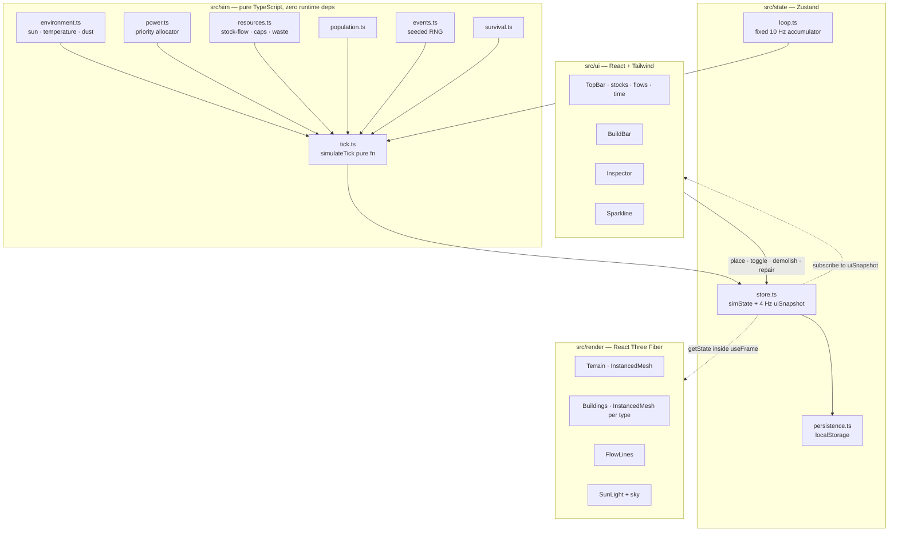
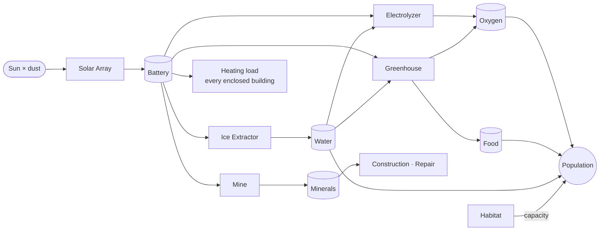

# Living Machine — Mars Colony Simulator

> A browser-based Mars colony that runs itself. Not a 3D scene with animations on top —
> a deterministic resource simulation whose state the renderer merely draws.

## 1. Product

**One-liner:** Place buildings on a hex-tiled Mars surface and watch a real stock-and-flow
simulation redistribute power, water, oxygen, food and heat in real time.

**Audience:** Technical reviewers looking at a portfolio. The demo must be legible within
five minutes without instructions, and must reward inspection by an engineer who asks
"is the simulation real?"

**Core claim:** The interesting part is not the rendering. It is that the colony has a
constrained energy budget solved every tick by a priority allocator, and every visual —
sun angle, emissive night windows, flow line brightness — is a readout of that solver.

## 2. Scope

### In scope (v1)

- Hex-tiled procedurally generated Mars terrain with ice and ore deposits
- 9 building types, all procedurally generated geometry (zero asset files)
- 6 simulated resources: power, oxygen, water, food, minerals, heat
- Fixed-timestep deterministic simulation with 1x / 4x / 16x / pause
- Priority-based power allocation with battery buffering
- Day/night cycle driving solar output and heating load
- Population that grows on surplus and dies on shortage
- 4 random events (dust storm, meteor, oxygen leak, supply drop)
- Build / demolish / idle-toggle / repair
- HUD with stocks, net flows, sparkline history, survival score
- localStorage persistence

### Out of scope (v1)

Colonist AI and pathfinding, tech tree, multiple colony sites, audio, multiplayer,
custom GLSL shaders, particle systems, backend of any kind.

## 3. Success Criteria

1. First load shows a **working colony**, never an empty grid.
2. Adding a Solar Array measurably improves battery charge and night endurance.
3. Adding a Habitat raises life-support demand and visibly lowers the survival score.
4. Under an energy deficit, low-priority buildings throttle **in the documented order**
   and the Inspector shows their efficiency below 100%.
5. A dust storm can push a stable colony into crisis.
6. Reload restores the exact colony.
7. Same seed + same actions ⇒ same simulation outcome (enforced by unit tests).
8. Simulation cost stays inside a frame at the highest speed. **Measured:** 0.116 ms per
   tick at 197 buildings — 18.6% of one core at 16×, linear in building count. The main
   thread is sufficient; the Web Worker considered during design is not needed, and the
   isolation of `src/sim/` earns its keep through testability instead.

## 4. Architecture

The hard boundary in this codebase: **`src/sim/` is pure TypeScript and imports neither
`three` nor `react`.** It is a set of pure functions over a plain-data `SimState`. That is
what makes the simulation unit-testable, deterministic, serializable, and movable to a Web
Worker later without a rewrite.

### Why this split

| Decision                                      | Reason                                                    |
| --------------------------------------------- | --------------------------------------------------------- |
| Sim isolated from React/Three                 | Testable, deterministic, portable                         |
| Fixed 10 Hz timestep                          | Reproducible results independent of frame rate            |
| Render reads store imperatively in `useFrame` | Simulation ticks never trigger React re-renders           |
| UI subscribes to a 4 Hz snapshot              | HUD stays readable and cheap at 16x speed                 |
| InstancedMesh per building type               | One draw call per type instead of per building            |
| Procedural geometry                           | No asset pipeline, no licensing, consistent art direction |

## 5. Resource Loop

The loop is closed on purpose: every producer consumes something another producer makes.
There is no free resource except sunlight, and sunlight disappears for half of every sol.

## 6. Documentation Map

| Document                     | Contents                                              |
| ---------------------------- | ----------------------------------------------------- |
| `docs/FEATURES.md`           | Feature catalogue F-01..F-25 with acceptance criteria |
| `docs/ROADMAP.md`            | Day-by-day task list                                  |
| `docs/SPEC-01-simulation.md` | Tick order, allocator, formulas                       |
| `docs/SPEC-02-buildings.md`  | The 9 buildings and all tuning constants              |
| `docs/SPEC-03-world.md`      | Hex coordinates, terrain generation, deposits         |
| `docs/SPEC-04-rendering.md`  | Procedural geometry, instancing, day/night, palette   |
| `docs/SPEC-05-state.md`      | Store slices, loop, persistence schema                |
| `docs/SPEC-06-events.md`     | The 4 events and their effects                        |

Documents describe the **current design**, not a changelog. Numeric formulas live in code
docstrings; specs carry the model and the reasoning.
