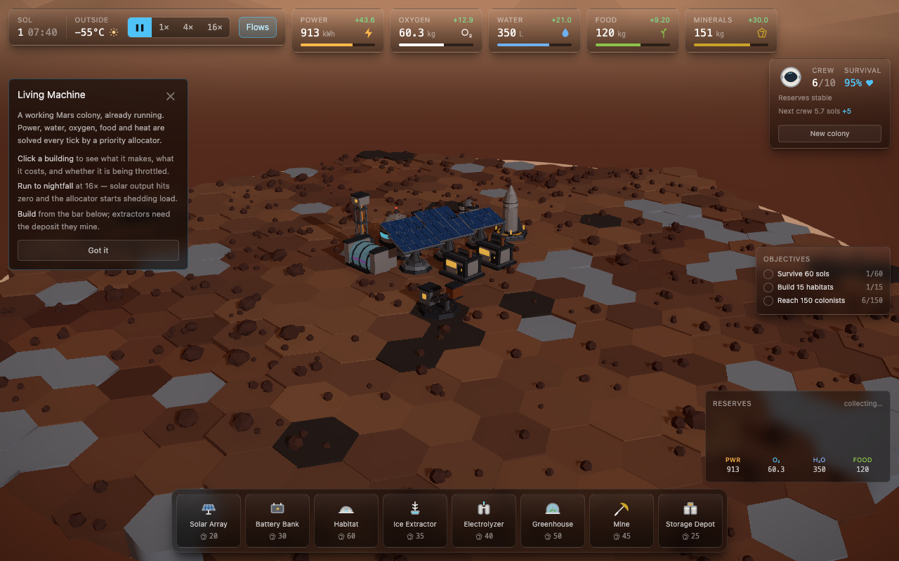
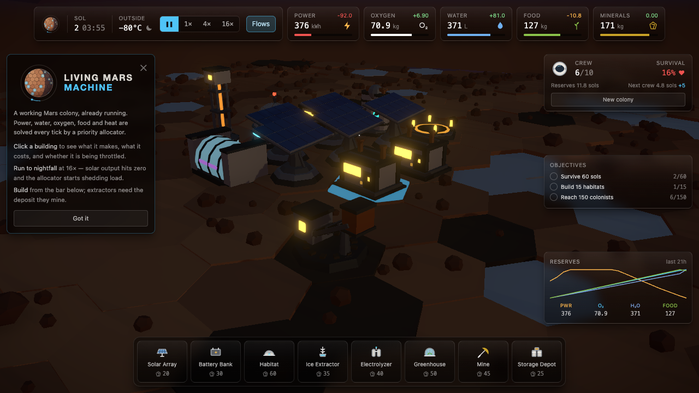

# Living Machine — Mars Colony Simulator

A browser Mars colony that runs itself: place buildings on procedurally generated hex
terrain and watch a deterministic stock-and-flow simulation redistribute power, water,
oxygen, food and heat every tick.

The rendering is the readout. The simulation is the product.



At night solar output reaches zero, the batteries carry the colony, and the allocator sheds
the mine and then the greenhouse to keep life support running until sunrise:



## Tech Stack

| Layer         | Tech                                              |
| ------------- | -------------------------------------------------- |
| Language      | TypeScript                                        |
| Rendering     | React 19, React Three Fiber, Three.js, postprocessing |
| Styling       | Tailwind CSS                                      |
| State         | Zustand                                           |
| Build         | Vite                                               |
| Testing       | Vitest (unit), Playwright (e2e)                   |
| Lint/Format   | ESLint, Prettier                                  |

## Quick Start

```bash
npm install
npm run dev          # http://localhost:5173
```

## Commands

| Command                                             | What it does                                         |
| --------------------------------------------------- | ---------------------------------------------------- |
| `npm run dev`                                       | Vite dev server with HMR                             |
| `npm run build`                                     | Type-check, then production build                    |
| `npm run preview`                                   | Serve the production build locally                   |
| `npm run typecheck`                                 | `tsc --noEmit`                                       |
| `npm run lint`                                      | ESLint, including the `src/sim` isolation rules      |
| `npm run test:e2e -- --grep "reference screenshot"` | Regenerate the screenshots in `docs/`                |
| `npm test`                                          | Vitest — simulation core                             |
| `npm run test:e2e`                                  | Playwright — renders and interacts with the real app |
| `npm run format`                                    | Prettier over source and docs                        |

## Measured Cost

The simulation runs on the main thread because it is cheap enough to. Tick cost, averaged
over 2000 ticks after warm-up (`src/sim/performance.test.ts` holds this to a ceiling):

| Buildings | ms / tick | Share of one core at 16× |
| --------- | --------- | ------------------------ |
| 13        | 0.011     | 1.7%                     |
| 100       | 0.057     | 9.2%                     |
| 197       | 0.116     | 18.6%                    |

Linear in building count. `src/sim/` is kept free of Three, React and the DOM partly so
that moving it to a worker would stay a one-file change — but there is no reason to.

## Architecture in One Paragraph

`src/sim/` is pure TypeScript with no dependency on Three.js, React or the DOM — an ESLint
rule enforces this, along with a ban on `Math.random()` and `Date.now()`. It exposes
`simulateTick(state, dt)`, a pure function over a JSON-serializable `SimState`. `src/state/`
drives that function on a fixed 10 Hz timestep and publishes a throttled 4 Hz snapshot for
the HUD. `src/render/` reads simulation state imperatively inside `useFrame`, so simulation
ticks never trigger React re-renders. All geometry is generated in code; the repository
contains no model, texture or audio files.

```
src/
  sim/      pure simulation — hex math, terrain, resources, allocator, events
  state/    Zustand store, fixed-timestep loop, actions, persistence
  render/   React Three Fiber scene, procedural geometry, sky, post-processing
  ui/       HUD built with React, Tailwind and hand-drawn SVG icons
```

Nothing in the repository is an asset. The terrain, all nine buildings, the rocket, the sky, the
pipework and every icon are generated in code — there is no model, texture, HDRI or icon
package anywhere in it.

## Documentation

| Document                                                   | Contents                                   |
| ---------------------------------------------------------- | ------------------------------------------ |
| [PRD.md](./PRD.md)                                         | Product definition, scope, architecture    |
| [docs/FEATURES.md](./docs/FEATURES.md)                     | Feature catalogue with acceptance criteria |
| [docs/ROADMAP.md](./docs/ROADMAP.md)                       | Day-by-day plan and progress               |
| [docs/SPEC-01-simulation.md](./docs/SPEC-01-simulation.md) | Tick order, allocator, formulas            |
| [docs/SPEC-02-buildings.md](./docs/SPEC-02-buildings.md)   | Buildings and every tuning constant        |
| [docs/SPEC-03-world.md](./docs/SPEC-03-world.md)           | Hex grid, terrain generation, deposits     |
| [docs/SPEC-04-rendering.md](./docs/SPEC-04-rendering.md)   | Geometry, instancing, day/night, palette   |
| [docs/SPEC-05-state.md](./docs/SPEC-05-state.md)           | Store slices, loop, persistence            |
| [docs/SPEC-06-events.md](./docs/SPEC-06-events.md)         | Events and their effects                   |

## Status

In development. See [docs/ROADMAP.md](./docs/ROADMAP.md) for what is built and what is next.
