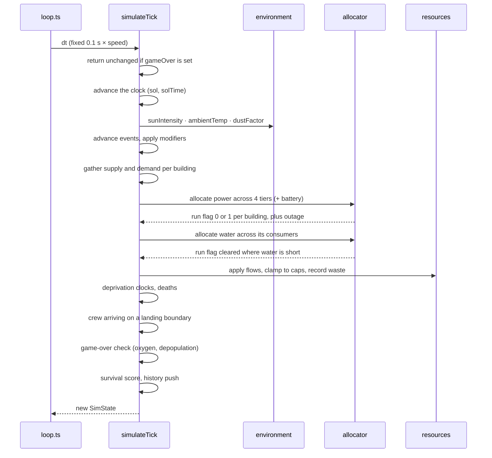

# SPEC-01 — Simulation Core

`src/sim/` is pure TypeScript. It imports neither `three` nor `react`, holds no module-level
mutable state, and exposes pure functions over a plain-data `SimState`. Every number below
is defined once, in [SPEC-02](./SPEC-02-buildings.md).

## Units and Time

| Quantity               | Unit                  |
| ---------------------- | --------------------- |
| Power flow             | kW                    |
| Power stock (battery)  | kWh                   |
| Oxygen, food, minerals | kg (flow: kg/sol)     |
| Water                  | L (flow: L/sol)       |
| Temperature            | °C                    |
| Time                   | sol (1 sol = 24.66 h) |

One sol takes 60 seconds of wall time at 1x. The simulation advances in fixed 0.1 s steps,
so one sol is 600 ticks at 1x. Speed multipliers run more ticks per frame; they never
change the step size.

```
dtSol   = dtSeconds * speed / SECONDS_PER_SOL
dtHours = dtSol * HOURS_PER_SOL
```

Flow rates are authored per sol because that is how a player reasons about them
("this greenhouse feeds eleven people"). Power is the exception: it is authored in kW
because that is how an engineer reasons about load.

## State Shape

`SimState` is JSON-serializable — no class instances, no `Map`, no `Set`. This is what makes
persistence and determinism trivial.

```ts
type SimState = {
  seed: number; // immutable, identifies the world
  rngState: number; // advances with every draw
  solTime: number; // [0,1) position within the current sol
  sol: number; // integer sols elapsed
  tiles: Tile[]; // terrain, generated from seed
  buildings: Building[];
  stocks: Record<ResourceKind, number>;
  population: number; // fractional internally
  deprivation: Record<'water' | 'food', number>; // sols of unbroken shortage
  gameOver: GameOver | null; // set once, never cleared
  activeEvents: ActiveEvent[];
  history: HistoryBuffer;
  lastReport: TickReport; // derived; what the UI reads
};
```

`deprivation` has to live here rather than on the report: the report is rebuilt from scratch
every tick, and the loop chains up to forty ticks between publishes. `gameOver` is here for
the same reason plus one more — it is persisted, so reloading a dead colony cannot resurrect
it.

`lastReport` is derived data cached on the state. It is rebuilt every tick and is the only
thing the HUD reads, so the UI never recomputes flows.

## Tick Order



Order matters and is fixed: environment before allocation (sun sets the supply), events
before allocation (a dust storm must apply to this tick's sunlight), deaths before arrivals
(a rocket landing into a famine must not kill its own passengers on the tick they touch
down).

The clock is advanced up front because the landing schedule is derived from `sol` and needs
to know which boundary this tick crosses. Events still receive the *old* sol, so their grace
period and notice numbering are unaffected.

## The Allocator

One function serves both power and water. That is the whole reason it is worth having.

```ts
allocateByPriority(available: number, demands: Demand[]): number[]
```

`available` is a rate (kW, or L/sol including what can be drawn from storage). `demands`
carry a tier. The allocator walks tiers ascending, giving each tier all it asks for while
supply lasts. The tier where supply runs out is throttled **proportionally** — every
building in that tier gets the same fraction — and every tier below it gets zero.

Proportional throttling within a tier is a deliberate choice over round-robin or
first-come: it is stable (no oscillation between ticks) and order-independent.

### Binary Production

The allocator's share decides **who** gets power. What the rest of the simulation reads is a
**run flag**, not an efficiency:

```
runFlag(b) = isFullyServed(share(b)) ? 1 : 0
```

A building served short of its full request produces nothing rather than a fraction. Within
a tier this is a cliff — three Ice Extractors served at 99% all stop together — and that is
the point: half a colony's power buys none of a colony's output.

Two consequences worth stating plainly:

- A stopped building still draws the share the allocator reserved for it. The power is burnt
  and nothing is made. It is **not** reallocated: a fixed-point iteration is unbounded, and
  "the grid spent it and produced nothing" is the intended punishment for an empty battery.
- Because production and consumption multiply by the same flag, a stopped Greenhouse also
  drinks no water. A water shortage therefore cannot feed itself.

Heating demand stays proportional. It is not production, and partial heating still has to
starve tier 1 so `lifeSupportDeficit` can see it.

### Grid Outage

```
outage = batteryStock <= 0 && solarKW < demandKW
```

An outage forces **every** run flag to zero, tier order notwithstanding — an Ice Extractor
that live solar could still have covered stops with everything else. This is the difference
between a brownout, which the tiers already model well, and a collapse.

`batteryStock` is the stock entering the tick, so the outage is declared on the tick after
the battery empties. The alternative is a self-referential predicate, and one tick is 0.1 s.

### Power Tiers

| Tier | Consumers                                                   | Rationale                                                  |
| ---- | ----------------------------------------------------------- | ---------------------------------------------------------- |
| 1    | Habitat life support and heating (all buildings' heat load) | People die first, everything else second                   |
| 2    | Ice Extractor, Electrolyzer                                 | Water and oxygen are life-critical but buffered by tanks   |
| 3    | Greenhouse                                                  | Food buffers longest, so it yields before water and oxygen |
| 4    | Mine                                                        | Minerals are pure convenience; nobody dies without them    |

If tier 1 is throttled, the state carries a `lifeSupportDeficit` flag and colonists start
dying immediately, with no grace period. That is the only way to lose a colony to cold.

### Battery

The battery is not a tier; it is extra supply, and it is charged only from what survives
all four tiers. Access to it is gated per tier by the reserve thresholds in
[SPEC-02](./SPEC-02-buildings.md): a tier below its threshold is allocated against live
solar alone. That is implemented as two passes of the same allocator rather than a special
case inside it.

```
dischargeCapKW = min(batteryStock / dtHours, dischargeRateMax)
withBattery    = demands whose tier clears its reserve threshold
shed           = the rest

pass 1: allocate(solarKW + dischargeCapKW, withBattery)
        dischargedKW = max(0, granted - solarKW)
        solarLeftKW  = max(0, solarKW - granted)
pass 2: allocate(solarLeftKW, shed)

chargeKW = min(solarLeftKW - granted₂, chargeRateMax, (capacity - stock) / dtHours)
battery += (chargeKW - dischargedKW) * dtHours
wastedKW = solarLeftKW - granted₂ - chargeKW
```

Wasted power is reported, not hidden. Seeing "42 kW wasted" at noon is exactly the signal
that the colony needs another battery bank, and it teaches the player the system.

### Water

Water runs through the same allocator after power, because a stopped Electrolyzer demands no
water at all. Its tiers: population (1), Electrolyzer (2), Greenhouse (3). Colonists are
entered as a tier-1 demand so no building can drink ahead of them, but their share is not
binarised — they drink whatever reaches them, and a shortfall shows up as a falling stock.

The population's demand is the **effective** head count, not the raw one; see Population
below.

**Known simplification:** the two passes are not iterated to a fixed point. A building
stopped by water still had power reserved for it in the power pass; that power is counted as
waste rather than reallocated. One iteration is accurate to within a few percent at these
scales and is O(n) with no convergence risk. Documented rather than hidden.

## Resource Application

```
stock' = clamp(stock + (production - consumption) * dtSol, 0, cap)
wasted = production - consumption - (stock' - stock) / dtSol   // when clamped at cap
```

Caps come from a base value plus every Storage Depot. Battery Banks cap power the same way.

## Population

Fractional internally so the count is smooth at any speed; rounded only for display.

**There is no organic growth.** Colonists arrive by rocket and by nothing else, on the fixed
schedule in [SPEC-02](./SPEC-02-buildings.md): every seven sols, five more each time. The
player cannot refuse, delay or idle a landing — that ramp is the difficulty curve, and it is
the reason a colony that has stabilised still has to keep building.

### Overflow

```
effective = population + max(0, population - habitatCapacity)
```

Colonists above habitat capacity live rough and cost double. Only the overflow is doubled:
capacity 10 with a population of 14 draws as 18. This figure — not the raw head count — is
what charges oxygen, water and food, and what the deprivation thresholds below compare
against, so the countdown never disagrees with what is actually being consumed.

### Deprivation

Oxygen has no grace period: reaching zero is an immediate loss (below). Water and food each
run a sticky clock, in sols, kept on `SimState`:

```
required = effective × perCapita(kind)
deprived = stock < required                    // the clock starts here, not at zero

timer' = deprived ? min(timer + dtSol, GRACE_SOLS[kind] + DEATH_RAMP_SOLS)
                  : max(0, timer - dtSol × DEPRIVATION_RECOVERY_RATE)
```

Two deliberate choices:

- The clock starts when the stock drops below a single sol of need, not when the tank is
  empty. By the time it is empty the rationing has been going on for a while.
- Relief unwinds the clock at a quarter rate rather than resetting it. A colony that scrapes
  through one drought carries the debt into the next, so repeated shortages compound. The
  leftover timer is that debt — it does not keep killing after the tanks refill.

The upper clamp is load-bearing: it bounds the death rate, which is what keeps the
arithmetic below from going negative, and stops a colony that survived a long drought from
being erased instantly by the next one.

### Death

```
overrun = max(0, timer - GRACE_SOLS[kind])
rate    = deprived && overrun > 0 ? DEATH_RATE_PER_SOL × (1 + overrun × DEATH_ACCELERATION) : 0
total   = Σ rate over water and food, + DEATH_RATE_PER_SOL if lifeSupportDeficit
pop'    = max(0, pop × (1 - total × dtSol))
```

Deaths run only while `deprived`. Water and food run independently and their rates add — a
colony out of both is in worse trouble than one out of either. The rate is linear in the
overrun, which compounds into something much steeper in the population itself: 2 %/sol at
the deadline, 32 %/sol five sols after it. That is what makes a late rescue feel late.

A life-support deficit contributes a flat rate with no grace period. Freezing is the one way
to lose a colony to cold, and giving cold a grace period while oxygen has none would be
incoherent.

### Game Over

Two terminal states, both sticky and both persisted:

| Cause         | Trigger                            |
| ------------- | ---------------------------------- |
| `oxygen`      | the oxygen stock reaches zero      |
| `depopulated` | fewer than one colonist is left    |

Once `gameOver` is set, `simulateTick` returns its input unchanged — the same object, not a
copy, so nothing downstream churns — and the loop stops stepping entirely. Suffocation is
exact-comparable because stocks are clamped at zero. `depopulated` exists so a colony
starved down to nobody ends rather than simulating an empty base forever.

## Survival Score

A heuristic, 0..100, deliberately not a Monte Carlo projection — the score must update
every tick without a worker.

```
daysLeft(r) = stock(r) / max(netDrain(r), EPSILON)      // +Infinity when in surplus
worst       = min over life-critical resources
base        = 100 * (1 - exp(-worst / SURVIVAL_HORIZON_SOLS))
score       = base * energyPenalty * lifeSupportPenalty
```

Surplus resources score high but not instantly 100 — a colony one meteor away from
disaster should not read as perfectly safe.

## Determinism

`mulberry32` seeded from `SimState.rngState`, which is threaded through the state and
advanced on every draw. No `Math.random()` anywhere in `src/sim/`. Consequences:

- The same seed and the same action sequence reproduce the same colony, exactly.
- Save files replay identically.
- Event tests are ordinary assertions instead of statistical ones.

## Test Plan (`src/sim/*.test.ts`)

| Test                    | Asserts                                                                |
| ----------------------- | ---------------------------------------------------------------------- |
| Purity                  | `simulateTick` does not mutate its input                               |
| Determinism             | Two runs from the same seed produce identical states after 1000 ticks  |
| Energy conservation     | supplied = consumed + charged + wasted, within float tolerance         |
| Throttle order          | Under deficit, tier 4 hits zero before tier 3 is touched               |
| Proportional throttling | Two identical buildings in the throttled tier receive equal efficiency |
| Cap overflow            | Production above cap raises `wasted` and never exceeds the cap         |
| Non-negativity          | 2000 ticks under extreme deficit produce no negative stock and no NaN  |
| Night load              | Heating demand at midnight exceeds noon demand by the documented ratio |
| Survival monotonicity   | Adding a producer never lowers the score for its resource              |
| Binary production       | Every run flag is exactly 0 or 1 over 2000 ticks; a shed tier is 0     |
| Grid outage             | Empty battery plus short solar stops every producer, tier order aside  |
| Overflow                | Capacity 10 with 14 colonists consumes as 18                          |
| Deprivation start       | The clock starts below one sol of need, not at an empty tank           |
| Slow recovery           | Two sols of relief undo half a sol of a two-sol debt                   |
| Death acceleration      | The second sol past a deadline costs more than the first               |
| Non-negativity          | 5000 ticks of total deprivation never drive the population below zero  |
| Landing schedule        | Five arrive on the sol-7 boundary, ten on the sol-14 one, none between |
| Game over               | Zero oxygen ends the colony, and a finished tick returns its own input |
