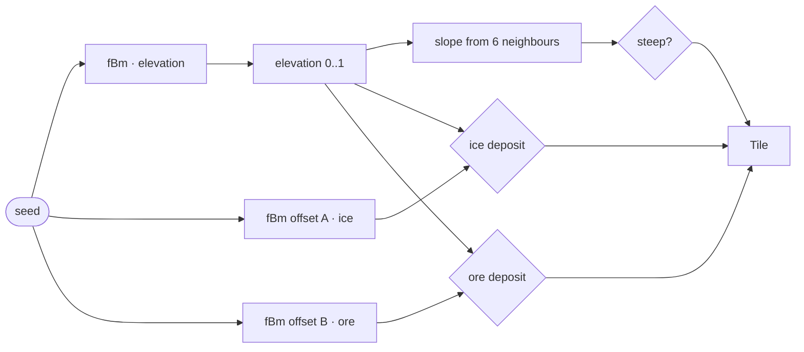

# SPEC-03 — World Generation

## Hex Grid

Flat-top hexes in **axial coordinates** `(q, r)`. Axial is the right choice here: two
integers instead of three, trivial serialization, and neighbour lookup is a fixed table.

```
radius 10 → 3 × 10 × 11 + 1 = 331 tiles
```

Neighbours, in fixed order (used by slope calculation and flow lines):

```
(+1, 0) (+1, −1) (0, −1) (−1, 0) (−1, +1) (0, +1)
```

World-space conversion for flat-top hexes of size `s`:

```
x = s × 1.5 × q
z = s × √3 × (r + q / 2)
```

The third cube coordinate is implied: `s = −q − r`. Distance uses it:

```
distance(a, b) = (|Δq| + |Δq + Δr| + |Δr|) / 2
```

Tiles are stored as a flat array with an index map from `"q,r"` keys, not a nested array —
axial grids are not rectangular and a sparse map costs more than it saves at 331 tiles.

## Value Noise

A hand-written implementation, roughly 30 lines, deliberately not a dependency. Portfolio
value aside, it must be seedable and reproducible, which most tiny npm noise packages are
not without extra work.

- Integer lattice hash → pseudo-random gradient in `[0,1)`
- Smoothstep interpolation between lattice corners
- 3 octaves of fBm, lacunarity 2.0, gain 0.5

Seeded from `SimState.seed`, so the same seed always regenerates the identical world and
terrain never needs to be saved — only the seed does.

## Terrain



```ts
type Tile = {
  q: number;
  r: number;
  elevation: number; // 0..1, world height = elevation × MAX_ELEVATION
  deposit: 'none' | 'ice' | 'ore';
  steep: boolean; // slope above threshold — boulders, not a placement block
  buildingId: string | null;
};
```

| Parameter             | Value                                 |
| --------------------- | ------------------------------------- |
| `HEX_SIZE`            | 1.0 world unit                        |
| `MAX_ELEVATION`       | 0.6 world units                       |
| `NOISE_SCALE`         | 0.18 (elevation)                      |
| `DEPOSIT_NOISE_SCALE` | 0.55 (ice and ore)                    |
| `SLOPE_LIMIT`         | 0.25 elevation delta to any neighbour |

`SLOPE_LIMIT` marks rough ground; it does not gate placement. See "Steep tiles" below.

Deposits sample at three times the elevation frequency. At the elevation scale a single
noise feature spans a third of the map, which yields one enormous ice field rather than the
scattered pockets that make placement a decision.

Elevation is intentionally shallow. This is a resource simulation on a plateau, not a
mountain range: tall terrain would occlude buildings and fight the camera.

## Deposits

- **Ice** where its noise channel exceeds 0.62 **and** elevation is below 0.45 — ice
  collects in the basins, which is both physically suggestive and gameplay-useful, since
  it puts extractors down where they are visible.
- **Ore** where its channel exceeds 0.65 **and** elevation is above 0.40 — ore in the
  highlands, so the two deposit types rarely compete for the same tile.

**Minimum-count guarantee:** the generator counts deposits and, if either type falls below
4 tiles, lowers that channel's threshold by 0.02 and re-evaluates, up to 10 times. Without
this a small fraction of seeds would produce an unplayable world. The retry is fully
deterministic — same seed, same thresholds, same result.

Deposits are finite in placement, not in yield: a Mine on ore never depletes. Depletion
would add a resource-scarcity clock that fights the "watch the system breathe" premise.

## Colouring

Terrain colour is computed per tile at generation and written into the InstancedMesh
colour attribute — no per-frame work.

| Tile           | Colour intent                                                                 |
| -------------- | ----------------------------------------------------------------------------- |
| Low elevation  | Deep rust, slightly desaturated                                               |
| High elevation | Pale ochre, warmer                                                            |
| Ice deposit    | Cold blue-white tint blended over the base                                    |
| Ore deposit    | Cool dark grey — a brown ore tint is indistinguishable from elevation shading |
| Steep          | Base colour, plus a visible rock outcrop mesh                                 |

### Steep tiles

Steep ground is terrain character, not a rule. Anything can be built on it: the crew clears
the boulders as part of the build, at no extra cost, and the outcrop mesh disappears for as
long as a building stands there. Demolishing puts the boulders back.

Two things still follow the flag. Deposits never generate on steep tiles — a seam under a
boulder field reads as a bug rather than as a find — and the starting colony prefers flat
ground, so a new game opens on a tidy cluster rather than straddling a ridge.

Boulders are geometry rather than an overlay colour, so rough ground stays legible when a
hover highlight is drawn on top of it.
