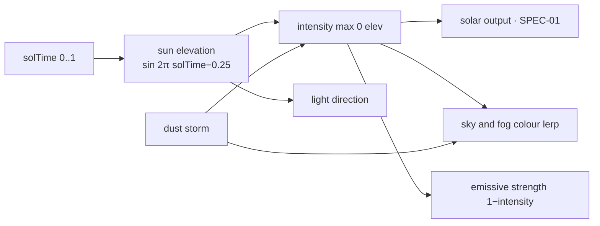

# SPEC-04 — Rendering

Stack: React Three Fiber v9 on Three.js, plus `@react-three/postprocessing` for the
screen-space pass. No helper library beyond that — OrbitControls comes straight from
`three/examples` in about forty lines of wrapper. Everything drawn is generated in code;
the repository contains no model, texture or HDRI files.

## What Makes the Scene Read as a Planet

Four things, in descending order of impact. Recorded because each was added after a
screenshot showed the scene looking like a board game rather than a place:

1. **The world continues past the board.** A gradient sky dome, a ring of fogged hills and
   a ground plane meeting the grid at tile-top height. Without these the hexes float in a
   void, and no amount of building detail fixes it.
2. **Ambient occlusion.** Contact shadows are what seat a building on its tile. Nothing
   else in the pipeline darkens the crevice where geometry meets geometry.
3. **Scatter.** Boulders on unbuildable tiles, pebbles on the rest, and a hashed colour
   wobble per tile. A field where every tile of an elevation is one flat colour reads as a
   spreadsheet.
4. **Pipework.** Physical pipes between buildings turn a set of models parked on tiles into
   connected infrastructure.

## Sky and Horizon

A back-faced sphere with a fragment shader: a height ramp from horizon to zenith, a sun
glow term, and a haze band that thickens toward the ground line. It is a shader rather than
a texture because it is re-tinted every frame from `solTime` — swapping uniforms is free,
regenerating an image is not.

Colours are lerped between day, night and storm palettes. The fog colour tracks the dome's
horizon band; if the two drift apart, distant geometry visibly separates from the sky.

**Light colour must be chosen against the palette it lands on.** A saturated blue night
fill multiplied against rust terrain produces black — the night fill is near-neutral for
this reason, and it is the single easiest mistake to repeat here.

## Materials and the Glow Mask

Buildings are one instanced mesh per type, which means one material per type — but a
habitat needs a lit window band and an unlit hull simultaneously. Geometry therefore carries
two attributes:

| Attribute | Purpose                                                                      |
| --------- | ---------------------------------------------------------------------------- |
| `color`   | Per-vertex base colour, multiplied by the per-instance status tint           |
| `aGlow`   | 0..1 emissive mask, patched into the standard material via `onBeforeCompile` |

The glow is multiplied by the surface colour and a night factor, so lights match the panel
they sit in, come on by themselves after dark, and go out when a building is idled — the
status tint dims the emissive along with everything else, for free.

## Post-processing

| Effect   | Job                                                                                                                          |
| -------- | ---------------------------------------------------------------------------------------------------------------------------- |
| N8AO     | Contact shadows. Kept at low intensity: pushed harder it greys out a warm palette and reads as dirt, not depth               |
| Bloom    | Makes emissive surfaces read as light sources. Thresholded so only genuinely emissive parts bloom; strength rises after dark |
| Vignette | Pulls attention to the middle of the frame, where the colony is                                                              |

## The Rendering Contract

**Simulation ticks must never cause a React re-render.** R3F components read simulation
state imperatively inside `useFrame`:

```ts
const { buildings, lastReport } = useSimStore.getState();
```

React re-renders only when the _structure_ changes — a building added or removed — which
is a user action, not a tick. This is what keeps 16x speed smooth: at 16x the simulation
runs 160 ticks per second and the React tree is untouched by all of them.

## Hex Orientation

`CylinderGeometry` places its first vertex on +z, which produces a **pointy-top** hex. The
axial layout in `sim/hex.ts` is flat-top, so every hex geometry is rotated by π/6 before
use. Without the rotation the tiles are correctly positioned but visibly fail to tessellate
— a gap appears between every pair of neighbours. Anything hex-shaped added later (highlight
slabs, placement ghosts) needs the same rotation.

## Instancing

| Mesh           | Instances             | Draw calls           |
| -------------- | --------------------- | -------------------- |
| Hex ground     | 217, split by deposit | 3 (rock / ice / ore) |
| Rock outcrops  | ~40                   | 1                    |
| Pebble scatter | ~300                  | 1                    |
| Distant hills  | 46                    | 1                    |
| Buildings      | up to ~200            | 1 per type in use    |
| Pipes          | one per link          | 1                    |
| Flow packets   | 3 per link            | 1                    |

Tiles are split into three meshes rather than tinted within one because ice needs a
different _material_ — a smooth, low-roughness sheet that catches the sun. A grey tint on a
rough material cannot express "there is water there".

Per-instance colour goes through `instanceColor`, so idle desaturation and damage tinting
cost a buffer write rather than a material. Matrices are recomputed only when a building is
added, removed or changes state — never per frame. See **Animated Objects** below for the
deliberate exceptions.

## Procedural Geometry

Each building is composed from primitives in `render/geometry/buildingGeometry.ts`, merged
into one `BufferGeometry` per type at startup. The design rule is **silhouette first**:
at the default zoom a building is roughly 60 px tall, so each type must be identifiable by
outline alone, before colour. Detail below that threshold — panel cells, hull ribs, banding
— exists for when the player zooms in, and costs nothing extra at distance because it is
all one mesh.

| Building      | Silhouette                                                            |
| ------------- | --------------------------------------------------------------------- |
| Solar Array   | Tilted cell grid on a mast — the only wide, flat, angled shape        |
| Battery Bank  | Squat ribbed stack behind a lit status board                          |
| Habitat       | Geodesic dome on a drum, window band, airlock tube                    |
| Ice Extractor | Lattice drill mast over a wellhead — the tallest thing on the map     |
| Electrolyzer  | Two banded columns, manifold, spherical accumulator                   |
| Greenhouse    | Glazed barrel vault over planting beds — the only horizontal cylinder |
| Mine          | Angled conveyor climbing out of a pit head                            |
| Storage Depot | Three sealed drums on a pallet with a labelled crate                  |
| Landing Pad   | A painted apron with corner lights — the only flat, ground-level shape |

**Scale has a hard ceiling.** A flat-top hex is √3 ≈ 1.73 units across and the widest
building is 1.32 units, so the instance scale cannot exceed ~1.2 without neighbouring
buildings visibly overlapping — which in a dense colony reads as a rendering bug.

Two facets earn their complexity. The habitat's dome is a real geodesic: an icosphere with
each face inset toward its own centroid, leaving strut gaps. A smooth dome does not read as
a Mars habitat. The solar array's cells are individual quads on a frame, so they survive any
zoom without a texture — and the panel tilt is deliberately shallower than a real array
would use, because a steeper one presents its unlit edge to a raised camera and renders as
a black slab.

**Merging requires identical attribute sets.** The hand-built geodesic shell has no UVs, so
`assemble` strips UVs from every part before merging. Nothing here is textured; this is both
the fix and a smaller vertex buffer.

## Materials and Palette

`MeshStandardMaterial` with flat shading. Low-poly plus flat shading gives faceted
highlights that read as stylized rather than unfinished, and it costs nothing.

| Role                          | Colour                     |
| ----------------------------- | -------------------------- |
| Terrain low / high            | `#8C4A32` → `#C98F63`      |
| Ground beyond the grid        | `#A8623F`                  |
| Ice sheet                     | `#C6D8E2` (roughness 0.12) |
| Ore                           | `#4C4038` (roughness 0.85) |
| Building shell                | `#D8D4CC`                  |
| Solar cell                    | `#6FA6DC`                  |
| Pipework                      | `#8A9096`                  |
| Accent (active)               | `#4FC3F7`                  |
| Warning (throttled)           | `#FFB74D`                  |
| Critical (damaged / shortage) | `#EF5350`                  |
| Sky zenith day → night        | `#C97F58` → `#141020`      |
| Sky horizon day → night       | `#F6CDA6` → `#2A2036`      |

The terrain is warm-neutral so that the status colours — cyan, amber, red — and the resource
colours are the only saturated things on screen. Status is readable at a glance without a
legend.

**Ore and ice must not converge.** Both started as greys and became indistinguishable; ore
is now warm and matte, ice cool and smooth. Two deposits the player must tell apart cannot
be separated by lightness alone.

**Metalness needs something to reflect.** There is no environment map, so a high-metalness
surface renders as a black hole in the map. Ore sat at 0.55 and looked like a void; it is
0.1 now.

## Resource Colours

Shared by the HUD icons, the stock bars and the 3D flow packets, so a colour means the same
thing in both places:

| Resource | Colour    |
| -------- | --------- |
| Power    | `#FFB74D` |
| Oxygen   | `#59D4F0` |
| Water    | `#6FB0F0` |
| Food     | `#8BC34A` |
| Minerals | `#C9A227` |

## Iconography

Hand-drawn inline SVG on a 24×24 grid, in `src/ui/icons.tsx` — no icon package, for the same
reason the 3D is procedural. The building icons are miniatures of their own silhouettes, so
the build bar reads as a catalogue of what is on the map rather than as abstract symbols.

## Day / Night



- One `directionalLight` arcing across the sky, casting shadows; a dim hemisphere light
  fills the shadows so the night side never goes fully black.
- Shadow map 2048², frustum fitted to the colony bounds, updated only when the sun moves
  past a threshold rather than every frame.
- Sky and fog colours lerp on sun intensity. During a dust storm both shift toward
  `#C1553A` and fog density roughly doubles — the storm is sold by the atmosphere, not by
  particles.
- Window emissive strength rises as `1 − sunIntensity`, so the colony lights up on its own
  as the sun goes down.

## Pipes and Flow Packets (F-19)

Steel pipes run between each producer and its nearest consumer, with glowing packets
sliding along them. The pipes are one stretched cylinder per link, oriented by a quaternion
between endpoints; the packets are a second instanced mesh, `toneMapped={false}` so they
stay saturated and trip the bloom threshold.

- Colour by resource: power amber, water blue, oxygen cyan, food green.
- A line either flows at full rate or is empty. Production is all-or-nothing
  ([SPEC-01](./SPEC-01-simulation.md)), so there is no partial speed to draw and a stopped
  producer collapses its packets to zero scale. The line is a readout of the allocator, not
  decoration.
- The HUD toggle controls the **packets**, not the pipes. Infrastructure always stands;
  what the player is switching off is the animated readout on top of it. There is no
  automatic cutoff at a building count — silently removing an overlay the player asked for
  would look like a bug rather than a courtesy.

Pairing is by nearest consumer per resource, not by a real network — [SPEC-01](./SPEC-01-simulation.md)
is explicit that there is no transmission topology. The lines visualize the allocation, and
the code comment must say so, so nobody later mistakes them for a graph solver.

## Animated Objects

Exactly three things in the scene move every frame, and they are the stated exception to
"matrices are recomputed only on a structural change":

| Object                            | File            | What moves                            |
| ---------------------------------- | --------------- | -------------------------------------- |
| `FlowPackets`                       | `Pipelines.tsx` | packets sliding along cable curves     |
| `Rocket`                            | `Rocket.tsx`    | one rocket descending and lifting off  |
| Solar arrays (`BuildingCluster`)    | `Buildings.tsx` | panel yaw tracking the sun's direction |

All three follow the same three rules, and anything added here must too:

1. Read state imperatively inside `useFrame` via `useStore.getState()`. None of them ever
   touch React, so a simulation tick still cannot re-render the tree.
2. Allocate no geometry, vectors, matrices or arrays per frame. Write into module-level
   scratch objects, or straight onto a ref's `position` / `scale`. (`Rocket` returns a small
   phase record and the solar arrays a yaw scalar each frame; that is a deliberate exception,
   taken because keeping the arithmetic pure is what makes it testable without a renderer.)
3. Drive the phase from the **simulation** clock — `sol + solTime` for a cycle that spans
   several sols (the rocket), `solTime` alone for anything that simply repeats every sol (the
   sun, and the arrays that track it). Pausing then freezes the animation and 16× speeds it
   up, both for free.

### The rocket

One landing cycle is `(sol + solTime) % LANDING_INTERVAL_SOLS`, split into rest on the pad,
lift-off, an empty sky, and descent. A single modulo drives the whole sequence, which is why
the visual and the simulation can never disagree about when a crew arrives.

That phase table lives in `render/rocketPhase.ts` rather than in the component, so it can be
tested without pulling react-three-fiber into a unit test (test).

Two constraints come from the sun rig:

- `ENTRY_ALTITUDE` is 12 units, held well under the directional light's ±24 shadow ortho. A
  higher spawn leaves the shadow frustum at low sun angles and its shadow silently stops
  rendering.
- The rocket casts a shadow only while it is on the pad. A hard shadow thrown from twelve
  units up sprawls across the whole colony; the contact shadow on the pad is the one that
  stops it reading as pasted on.

The plume is a separate mesh with `meshBasicMaterial` and `toneMapped={false}`, the same
recipe as the flow packets, so it clears the bloom threshold without a second light rig. The
body reuses `createBuildingMaterial`, which lights its window band at night through the
existing `aGlow` path.

### Solar arrays

Every solar array yaws in place to face wherever `SunLight.tsx` currently renders the sun,
using the same `sweep = 2π(solTime − 0.25)` angle as the light rig. Only yaw moves: the
panel's own tilt in `buildingGeometry.ts` is deliberately shallow so it doesn't present its
unlit edge to the camera, and steepening it to track elevation as well would reintroduce
exactly that problem at low sun angles.

The yaw math lives in `render/solarTracking.ts` rather than in `Buildings.tsx`, the same
split as `rocketPhase.ts`, so it is tested (`solarTracking.test.ts`) without a renderer.
Because only rotation changes frame to frame, `BuildingCluster`'s per-frame pass rewrites
just the instance matrix — colour and the bounding sphere, both invariant under rotation,
stay with the structural `useLayoutEffect` that runs on building-list changes.

## Camera (F-20)

`OrbitControls` with:

| Constraint  | Value                                                              |
| ----------- | ------------------------------------------------------------------ |
| Polar angle | 0.15π .. 0.45π (never below the horizon, never straight down)      |
| Distance    | 8 .. 45                                                            |
| Target      | clamped to the grid bounds so the colony cannot be lost off-screen |
| Damping     | 0.08                                                               |

Pan on right-drag or two-finger drag, orbit on left-drag, zoom on wheel or pinch. Left
click without drag is a selection or placement action, so the click/drag threshold is
explicit rather than inherited.

## Performance Budget

| Item                                | Budget                                                       |
| ----------------------------------- | ------------------------------------------------------------ |
| Draw calls                          | < 20                                                         |
| Post-processing                     | AO at half resolution, bloom with mipmap blur                |
| Triangles                           | < 150k                                                       |
| Per-frame allocations in `useFrame` | zero — vectors and matrices are module-level scratch objects |
| Shadow map updates                  | only on meaningful sun movement                              |
| Target                              | 60 fps at 200 buildings, mid-range laptop integrated GPU     |

### Measuring It

**F3** opens the profiler overlay: 30 s graphs of fps, draw calls and — on Chromium — JS
heap, plus the worst frame of the last 250 ms and the triangle count as plain readouts. Only
the fps track carries a dashed reference line, at the 60 fps target. Sampling lives in
`src/state/profiler.ts` (docs/SPEC-05-state.md); `RenderStatsProbe` reads the counters out of
`WebGLRenderer.info` and mounts only while the overlay is open.

The draw-call figure is the **whole frame**: the shadow pass and every post-processing pass
count alongside the scene, which is why the number sits nearer 70 than the < 20 in the table
above, and why it gets no budget line. The table budgets the scene itself — the part that
grows with colony size — so what the graph is read for is flatness: a jump when a building is
placed is a regression in instancing, while the composer's constant overhead is not.
