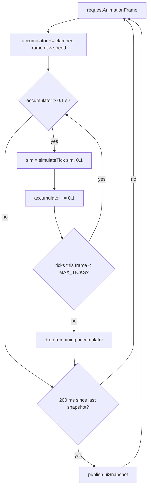
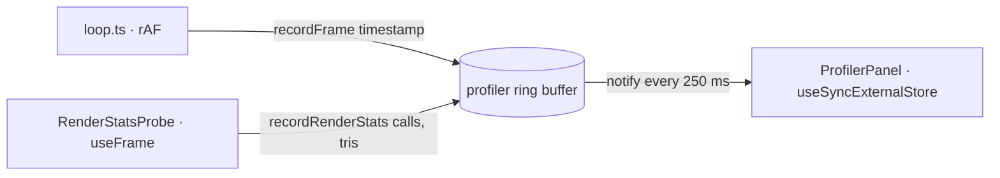
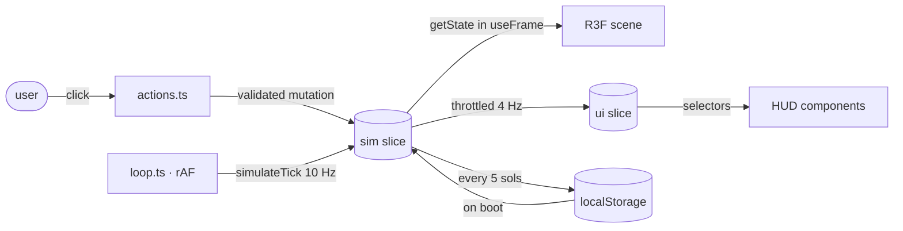

# SPEC-05 — State, Loop and Persistence

## Store Shape

A single Zustand store, three slices with different update frequencies. Splitting by
frequency rather than by domain is the whole design: it is what stops a 10 Hz simulation
from driving a 10 Hz React tree.

```ts
type Store = {
  // 10 Hz, mutated by the loop, read imperatively by the renderer.
  // NOT a React dependency anywhere.
  sim: SimState;

  // 4 Hz, throttled projection of sim.lastReport. The only thing the HUD subscribes to.
  ui: UiSnapshot;

  // Event-rate, ordinary React state.
  interaction: {
    speed: 0 | 1 | 4 | 16;
    buildMode: BuildingKind | null;
    selectedBuildingId: string | null;
    hoveredTile: AxialKey | null;
    showFlowLines: boolean;
    showProfiler: boolean;
  };
};
```

| Slice         | Frequency     | Consumer | Mechanism                                  |
| ------------- | ------------- | -------- | ------------------------------------------ |
| `sim`         | 10 Hz × speed | Renderer | `useSimStore.getState()` inside `useFrame` |
| `ui`          | 4 Hz          | HUD      | `useSimStore(s => s.ui.xxx)` selectors     |
| `interaction` | user actions  | Both     | ordinary selectors                         |

`UiSnapshot` carries stocks, net flows, caps, population, sol, survival score, active
events and the sparkline series — everything the HUD shows and nothing else. It is a flat
object of primitives so selector equality is cheap.

It also carries the alarm state: `outage`, `oxygenCritical`, `waterGraceLeft`,
`foodGraceLeft`, `waterDeprived`, `foodDeprived`, `overflowPopulation`, `solsUntilLanding`,
`nextLandingCrew` and `gameOver`.
The two grace figures are flattened to numbers rather than passed as `sim.deprivation`
directly, because that object is a fresh allocation every tick and a selector on it would
re-render every subscriber four times a second whether or not anything changed. The
deprived flags are the live shortage, not leftover timer debt — HUD warnings key off those,
so a colony that has restocked stops shouting even while the clock is still unwinding.
`gameOver` is safe to pass by reference: it changes at most once per colony.

`habitatCount` and `damagedBuildingCount` feed the objectives panel: the former against the
win threshold, the latter to surface the "repair" prompt for as long as it stays above
zero. Both are plain reduces over `sim.buildings`, computed fresh each snapshot rather than
stored on `SimState` — nothing else needs them, so there is no reason to carry them
further than the projection that does.

## The Loop



- **Fixed step:** always exactly 0.1 s of simulated time, never the frame delta. This is
  what makes results identical on a 144 Hz monitor and a throttled background tab.
- **Frame delta clamp:** raw frame delta is clamped to 0.25 s before scaling. Without it, a
  tab that was backgrounded for a minute returns and tries to simulate a minute in one
  frame.
- **Stops on game over.** The loop gates on `sim.gameOver === null` as well as `speed > 0`.
  `simulateTick` already returns its input unchanged, but without the gate the loop still
  spins forty no-op iterations a frame and keeps re-entering the autosave branch.
- **`MAX_TICKS_PER_FRAME` = 40:** the spiral-of-death guard. If the machine cannot keep up
  at 16x, simulated time falls behind wall time — the correct failure mode. The alternative
  (an ever-growing accumulator) locks the browser.
- The loop lives outside React, driven by a single `requestAnimationFrame` chain started
  once on mount.
- **`renderSolTime()`** is the clock the renderer reads, not `sim.solTime`. A tick is 0.1 s,
  so on a 120 Hz display `sim.solTime` holds still for a dozen frames and then jumps —
  visible judder on anything that moves slowly, worst at 1x. `renderSolTime()` carries
  `sim.solTime` forward by the fraction of a tick already in the accumulator, so it advances
  every animation frame and collapses back onto `sim.solTime` exactly on tick. It is
  presentation only: nothing in `src/sim/` ever sees it, so determinism is untouched.

## Frame Profiler

`src/state/profiler.ts` samples frame timing, draw calls and JS heap for the F3 overlay. It
sits **outside** the store on purpose: it measures the host machine, not the colony, and a
number that changes every frame has no business inside the state that persistence writes
and `simulateTick` has to stay pure over.



- **Windowed, not per-frame:** one sample per 250 ms carrying average fps and the _worst_
  frame of the window. A mean of 16 ms hides a 90 ms hitch, and a React update per frame
  would cost more than the thing it measures.
- **120 samples** — a 30 s window, long enough to watch a heap slope develop.
- **Frames longer than 1 s are dropped**, not recorded: rAF stops while the tab is hidden,
  so the first frame back carries the whole hidden duration and would peg the scale.
- **`interaction.showProfiler`** gates both the panel and `RenderStatsProbe`. Sampling keeps
  running while the overlay is closed — that is what fills the graphs the instant it opens —
  but the ring is written in place and the ordered array is materialised only when something
  reads it, so a closed overlay allocates nothing per sample.
- **Draw calls and triangles are `null`** for any window the probe was not mounted for. The
  panel breaks the line there rather than plotting a zero, which would be indistinguishable
  from the instancing regression the graph exists to catch.
- **Heap is Chromium-only** (`performance.memory`). Elsewhere the sample carries `null` and
  the track is omitted rather than drawn as zero.

## Actions

All in `src/state/actions.ts`. Each validates against `SimState`, then applies a pure
transform. Actions never touch the renderer directly.

| Action                      | Validation                                                       | Effect                                     |
| --------------------------- | ---------------------------------------------------------------- | ------------------------------------------ |
| `placeBuilding(kind, q, r)` | tile exists, buildable, empty, deposit matches, minerals suffice | deducts cost, appends building, marks tile |
| `demolishBuilding(id)`      | building exists                                                  | refunds 50%, removes it, clears the tile   |
| `toggleIdle(id)`            | building exists, not damaged                                     | flips `active` ⇄ `idle`                    |
| `repairBuilding(id)`        | damaged, minerals suffice                                        | deducts 30% of cost, sets `active`         |
| `setSpeed(n)`               | —                                                                | interaction slice only                     |
| `newColony(seed?)`          | —                                                                | regenerates world, reseeds, clears storage |
| `restartColony(seed)`       | —                                                                | clears the save, new colony, resumes at 1x |

`placeBuilding`, `demolishBuilding` and `toggleIdle` additionally refuse any kind whose
definition is not `buildable` — the Landing Pad. That check lives here rather than in
`checkPlacement` because the starting colony routes the pad through the same validation.

`restartColony` exists so the HUD button and the game-over screen share one implementation.
It forces speed back to 1: both callers can be sitting on a colony whose loop has stopped.

A failed validation returns a reason string that the HUD displays. There are no silent
no-ops: a click that does nothing without saying why reads as a bug.

## Persistence

```ts
type SaveFile = {
  version: 2;
  seed: number;
  rngState: number;
  sol: number;
  solTime: number;
  population: number;
  stocks: Record<ResourceKind, number>;
  buildings: Building[];
  activeEvents: ActiveEvent[];
  deprivation: Record<'water' | 'food', number>;
  gameOver: GameOver | null;
};
```

- **Terrain is not saved.** It is regenerated from `seed`, which is the payoff of keeping
  generation deterministic — the save file stays a few kilobytes regardless of grid size.
- **History is not saved.** The sparkline restarts empty after a reload. Persisting 120
  sols of four series to buy back a chart that refills in two minutes is not a trade worth
  making.
- **The landing schedule is not saved.** It is derived from `sol`, so there is no second
  source of truth to drift.
- Autosave every 5 simulated sols, on `visibilitychange`, and immediately when a colony ends
  — waiting for the next interval would let a reload resurrect a dead colony.
- On load, a `version` mismatch or a failed parse **starts a fresh colony**. There is no
  migration path and pretending otherwise would ship a class of bug that is invisible until
  it corrupts someone's save. v1 saves are therefore discarded.
- Key: `living-machine.save.v1`, deliberately unchanged across the v2 bump. Renaming it would
  orphan the old blob in localStorage forever; keeping it means the first v2 save overwrites
  it.
- `fromSaveFile` restores a dead colony as **alive**, runs its one priming tick, then
  re-applies the ending. `simulateTick` returns early once `gameOver` is set, so restoring it
  first would leave the template colony's report on screen under the game-over card.

## Data Flow Summary



The single most important arrow is the one that is missing: nothing goes from `sim` to
React on a tick boundary.
