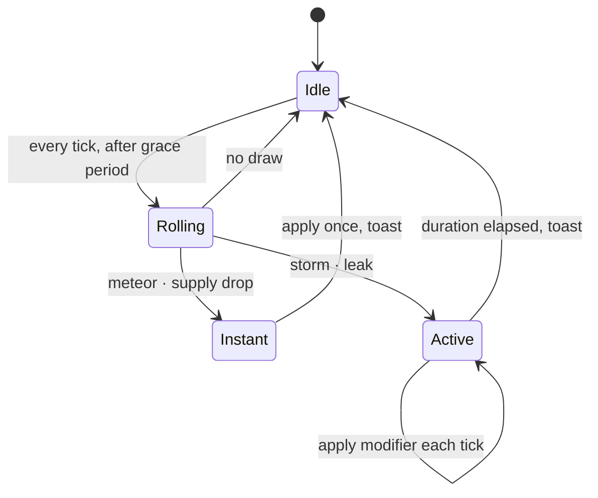

# SPEC-06 — Events

Events exist to make the colony's fragility visible. A perfectly tuned colony that runs
forever proves nothing; a colony that survives a dust storm proves the allocator works.

## Scheduling

All draws use the seeded RNG from [SPEC-01](./SPEC-01-simulation.md) — never `Math.random()`.

```
MEAN_EVENT_INTERVAL_SOLS = 12
GRACE_PERIOD_SOLS        = 8   // no events before this
per-tick probability     = dtSol / MEAN_EVENT_INTERVAL_SOLS
```

A Poisson-style per-tick draw rather than a countdown timer: it is memoryless, so the
interval distribution is correct at any speed multiplier and the result does not depend on
tick size.

The grace period is a deliberate design concession. A meteor at sol 2, before the player
understands what a Battery Bank does, teaches nothing but frustration.

Only one event of a given kind runs at a time; a second draw for an active kind is
discarded. Two different events can overlap, and that overlap is where the interesting
failures live.

## The Four Events

| Event         | Weight | Duration | Effect                                                              |
| ------------- | ------ | -------- | ------------------------------------------------------------------- |
| Dust Storm    | 35%    | 2–4 sols | `dustFactor` 0.3 → solar output falls 70%; sky reddens, fog doubles |
| Meteor Strike | 25%    | instant  | One random active building → `damaged`                              |
| Oxygen Leak   | 20%    | 1–2 sols | Oxygen stock drains an extra 8 kg/sol                               |
| Supply Drop   | 20%    | instant  | +80 minerals, +40 food                                              |

Weights sum to 100. Three of four are hostile: a supply drop that arrives one sol before a
storm feels like luck, which is the point of leaving it in.

### Dust Storm

The centrepiece. It attacks the one resource with no natural buffer — sunlight — and it
lasts long enough that batteries alone cannot cover it. The correct response is to idle
the mine and the greenhouse, which is exactly the interaction the whole simulation was
built to teach. Visually it is fog and sky colour, no particle system
(see [SPEC-04](./SPEC-04-rendering.md)).

### Meteor Strike

Picks uniformly among `active` buildings. A damaged building produces nothing but still
draws its heat load, so a meteor on the Ice Extractor starts a water countdown the player
can watch on the sparkline. Repair costs 30% of build cost — cheap enough that the failure
is recoverable, expensive enough that it hurts when minerals are tight.

If no active buildings exist the draw is discarded rather than retried, keeping the RNG
stream aligned with the seed.

### Oxygen Leak

A flat extra drain, not a percentage. Flat drains hurt small colonies more than large ones,
which puts the pressure where the game is most interesting.

### Supply Drop

The only positive event. It exists so that the toast component has to handle both tones and
so the event feed does not read as pure punishment.

## Lifecycle



```ts
type ActiveEvent = {
  kind: 'dustStorm' | 'oxygenLeak';
  solsRemaining: number;
};
```

Instant events leave no state — they mutate the colony and emit a toast. Only durational
events are stored, which keeps the save file honest: reloading mid-storm resumes mid-storm.

## `crewArrival` Is Not an Event

`EventKind` carries a fifth member, `crewArrival`, which shares the notice channel and the
toast presentation but is **not** a random event. It fires off the landing schedule in
[SPEC-02](./SPEC-02-buildings.md), which is derived from `sol`.

Consequences, all load-bearing:

- It must never appear in `EVENT_WEIGHTS`. A landing is not something the dice can grant.
- It is absent from `ActiveEvent['kind']`, which stays the narrow durational union.
- It is emitted by `simulateTick`, not by `advanceEvents`, and ignores the event grace
  period entirely.
- Anything sampling the event stream has to filter it out, or a landing every seven sols
  gets counted into the event rate.

## Presentation

- **Toast** on trigger: icon, name, one line of consequence ("Solar output down 70%").
  Auto-dismisses after 6 s; hostile events use the critical colour, the supply drop uses
  the accent colour. `sim.notices` lasts a single tick, so the toast copies each notice
  into a local queue and dismisses on its own timer — an empty later tick must not cancel
  the dismiss. One toast is visible at a time; later notices wait.
- **Badge** in the top bar while a durational event runs, with sols remaining.
- Toasts queue rather than stack — at 16x two events can fire within a second of wall time.

## Tests

| Test          | Asserts                                                           |
| ------------- | ----------------------------------------------------------------- |
| Determinism   | A fixed seed produces an identical event sequence across 500 sols |
| Grace period  | No event fires before sol 8                                       |
| Rate          | Over 1000 sols the observed mean interval is within 20% of 12     |
| No duplicates | A second dust storm cannot start while one is active              |
| Meteor safety | A meteor with zero active buildings is a no-op, not a crash       |
| Storm effect  | Solar output during a storm is 30% of the same tick without one   |
