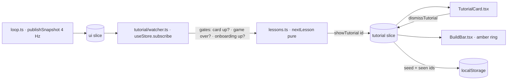

# SPEC-07 — Reactive Tutorial

## What it is for

The colony already tells the player _that_ something is wrong. `Alerts.tsx` raises the
alarms that end a run, and `QuestPanel.tsx` turns each one into a single-line prompt —
"Restore power", "Feed your people". Neither has room for the layer underneath: **why** the
simulation is doing this, and **which building** answers it.

That is this system's only job. Eleven lessons, each a pure predicate over the 4 Hz
`UiSnapshot`. When one first holds, a card appears in the left HUD column and the build bar
button that answers it starts glowing amber. Nothing pauses, nothing is blocked, and the
card stays until it is dismissed.

There is no scripted opening tour. `Onboarding.tsx` already names the three things a viewer
cannot infer, and a colony that is running fine has nothing to teach — a lesson is worth
reading exactly when its crisis is on screen.

## Flow

The selection runs **outside React**, in a `useStore.subscribe` watcher started next to
`startLoop()` in `App.tsx`. Choosing the lesson inside a component would mean a `setState`
in an effect purely to mirror derived state back into state — the same cascading render
`Onboarding.tsx` already refuses. Components read `tutorial.currentId` and draw it.

## The lessons

Authored most-lethal-first in `TUTORIAL_LESSONS`. **Array order is the priority**; there is
no separate priority field to drift out of sync with the order the reader sees.

| #   | Id                | Condition over `UiSnapshot`                                                  | Signposts     |
| --- | ----------------- | ---------------------------------------------------------------------------- | ------------- |
| 1   | `oxygenCritical`  | `oxygenCritical`                                                             | Electrolyzer  |
| 2   | `gridOutage`      | `outage`                                                                     | Battery Bank  |
| 3   | `nightBatteryLow` | `sunIntensity === 0` and `power.stock / power.cap < 0.05`                    | Battery Bank  |
| 4   | `waterShortage`   | `waterDeprived`                                                              | Ice Extractor |
| 5   | `foodShortage`    | `foodDeprived`                                                               | Greenhouse    |
| 6   | `buildingDamaged` | `damagedBuildingCount > 0`                                                   | — (inspector) |
| 7   | `dustStorm`       | a `dustStorm` is in `activeEvents`                                           | Battery Bank  |
| 8   | `overcrowded`     | `overflowPopulation > 0`                                                     | Habitat       |
| 9   | `mineralsEmpty`   | `minerals.stock` below the cheapest building and `buildingCounts.mine === 0` | Mine          |
| 10  | `wastingOutput`   | water, food, oxygen or minerals reports `wasted > 0`                         | Storage Depot |
| 11  | `firstLanding`    | `solsUntilLanding < 1` and `buildingCounts.habitat < 2`                      | Habitat       |

Three of these carry a decision worth recording:

- **`wastingOutput` excludes power.** Solar surplus is discarded on every clear sol by
  design (SPEC-01), so including power would fire the Storage Depot lesson on sol 1 and
  teach the opposite of the truth. A unit test guards it.
- **`buildingDamaged` signposts nothing.** Its answer is the Repair button inside
  `InspectorPanel.tsx`, not a build bar entry, so the card says so in words rather than
  pointing at an arbitrary button.
- **`mineralsEmpty` reads the cheapest cost from `BUILDING_DEFINITIONS`** instead of
  restating 20. SPEC-02 owns balance numbers and `src/sim/constants.ts` is their only home
  in `src/`.

## Selection rules

- **One card at a time.** `nextLesson` returns the first triggered, unseen lesson in array
  order, stopping there.
- **No preemption.** Once `currentId` is set the card is sticky: a more urgent lesson waits
  for the dismissal. A card that swapped its own text under a reader teaches nothing.
- **Sticky against its own condition, too.** The card survives the condition clearing. A
  player who fixed the problem by accident is exactly the one who needs to read why.
- **Immediate.** The first snapshot in which the predicate holds raises the card; there is
  no debounce. The snapshot is already a 4 Hz average, and the conditions here are states
  the colony sits in for sols rather than values that flicker across a threshold.
- **Silent while** `gameOver !== null`, while the orientation card still owns the left
  column, or while a lesson is already up.

## Cost

`nextLesson(context, seen)` walks the table in priority order and short-circuits at the
first match, so a colony in trouble evaluates fewer predicates than a healthy one — and a
healthy one evaluates eleven boolean reads over an object the HUD had already built. That
runs on each snapshot, four times a second, and is nothing beside the tick it rides on.

It is deliberately **not** memoised. An earlier version cached the triggered set between
snapshots and skipped the selection when it had not moved, which was faster and wrong: two
of the watcher's three suppression gates lift without touching the store at all — the
orientation card dismisses itself in local React state — so a cache that recorded "already
considered this situation" never reconsidered it, and any lesson raised behind that card was
lost for the rest of the run. Recomputing is both cheaper to run and cheaper to be sure of.

Re-render cost is controlled the way the rest of the HUD controls it (ROADMAP, Day 4):
`TutorialCard` selects `currentId` and `BuildBar` selects the signposted `BuildingKind` —
both stable under `Object.is`, so neither re-renders on a snapshot tick.

`UiSnapshot` gained `buildingCounts`, produced by `countByKind` in `sim/resources.ts`. The
lessons ask questions like "does this colony own a mine yet" that the aggregate counts
cannot answer; one reduce answers all nine, and `habitatCount` now reads from it rather than
walking the list a second time.

## Persistence

Key `living-machine.tutorial.v1`, holding `{ seed, seenIds }`.

Deliberately **not** part of `SaveFile`. Bumping `SCHEMA_VERSION` discards every existing
colony — `persistence.ts` has no migration path by design — and losing a run to make room
for tutorial bookkeeping is a bad trade.

"Once per colony" falls out of storing the seed alongside the list. Both restart paths call
`restartColony(Math.floor(Date.now() % 100000))`, so a new colony never matches the stored
seed and starts with an empty set, while a reload of the same colony matches and keeps its
dismissals. `newColony` also clears the entry outright, after `setSim` so the write lands
against the new seed.

Only a dismissal is recorded. A card that vanished because its condition cleared was never
read, so it is not marked seen — but that cannot happen today, because the card does not
vanish on its own.

The write happens outside the zustand `set` updater. An updater that touches the outside
world is no longer a function of its input, and the store makes no promise about how many
times it calls one.

## Signposting

The build bar ring is **amber** (`#FFB74D`), never the armed-placement blue (`#4FC3F7`).
The two states mean different things — "you have chosen this" against "this is what you are
being told about" — and a player who cannot tell them apart learns the wrong lesson about
their own click. A button that is both armed and signposted renders as armed.
